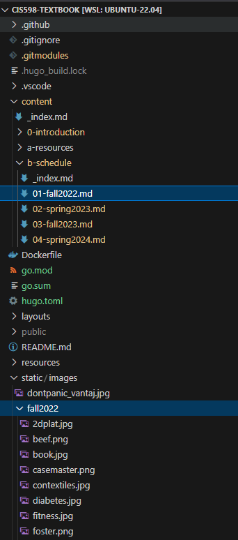
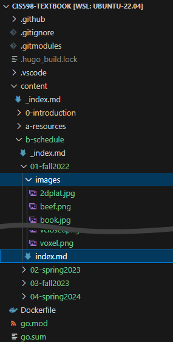

In Summer 2024 this theme was updated to match version 6.0.0 of the base [Hugo Relearn Theme](https://github.com/McShelby/hugo-theme-relearn/releases/tag/6.0.0)

## New Features

A full list of changes to the theme can be found on the [What's New](https://mcshelby.github.io/hugo-theme-relearn/basics/migration/index.html) page and in the [Documentation](https://mcshelby.github.io/hugo-theme-relearn/basics/history/index.html).

Some notable feature updates:

* [Swagger Shortcode now OpenAPI]({})
* [Attachments Shortcode now Resources]({})
* [Many Shortcodes & Markdown Items Throw Errors/Warnings on Missing Resources - Configurable](https://mcshelby.github.io/hugo-theme-relearn/basics/migration/index.html#600)
* [Math No Longer Requires Shortcodes if Passthrough Enabled](https://mcshelby.github.io/hugo-theme-relearn/shortcodes/math/index.html#passthrough-configuration)
* [IE 11 Support Removed](https://mcshelby.github.io/hugo-theme-relearn/basics/migration/index.html#600)
* [FontAwesome Updated to 6.5.2](https://mcshelby.github.io/hugo-theme-relearn/basics/migration/index.html#600)
* [Frontmatter menuTitle now linkTitle](https://mcshelby.github.io/hugo-theme-relearn/basics/migration/index.html#600)
* Configuration file moved from `config.toml` to `hugo.toml` to match Hugo changes
* Lots of theme configuration options were added to `hugo.toml`

In addition, the theme now supports installation via [Hugo Modules](https://gohugo.io/hugo-modules/use-modules/) as well as Git Submodules. We plan to migrate all textbooks to a Hugo Modules setup since it is more portable and easy to configure.  [More Information](https://mcshelby.github.io/hugo-theme-relearn/basics/installation/index.html).

## Upgrading and Switching to Hugo Modules

To Upgrade the theme and switch from a Git Submodule to a Hugo Module, do the following:

1. Ensure that a recent version of [Go](https://go.dev/dl/) and [Git](https://git-scm.com/downloads/) is installed.
2. Install [Hugo v0.126.1](https://github.com/gohugoio/hugo/releases) or later. 
3. Initialize the Hugo Module system. The name of the module doesn't matter since it won't be used - just use the name of the repository, such as `hugo mod init cis598-textbook`. This should create a file `go.mod` listing the name of the module and the version of `go` used. 
    1. The module import is already defined at the bottom of the new `hugo.toml` file and doesn't need to be configured.
4. In the textbook directory, remove the submodule using `git rm themes/hugo-theme-relearn`. This should remove that directory as well as update the `.gitmodules` file to remove the submodule. If desired, also delete the `themes` directory itself using `rmdir themes`.  
5. Create a new file `hugo.toml` using this [sample file](https://github.com/ksu-cs-textbooks/hugo-theme-relearn/blob/main/hugo.toml.sample) as a template.
    1. Look for items labelled `# TODO changeme` to see what settings should be updated for each site. Many settings can be carried over from the existing `config.toml` but some settings are new. [Configuration Documentation](https://mcshelby.github.io/hugo-theme-relearn/basics/configuration/index.html).
    2. One recommendation is to use the [Todo Tree](https://marketplace.visualstudio.com/items?itemName=Gruntfuggly.todo-tree) extension in VS Code, which will highlight comments containing `TODO` and other keywords, making them easy to find. 
    3. The theme has changed how URLs are handled for sites served in subdirectories (such as `textbooks.cs.ksu.edu/cis598`). The `canonifyURLs` setting is deprecated and should be set to `false`, along with the `relativeURLs` setting set to `false`. This may break some image links - see below.
6. Once the configuration is updated in `hugo.toml`, delete the existing `config.toml` as it is no longer needed. 
7. Install the Hugo module using `hugo mod get -u`. This should install the module and create a file `go.sum` that includes the checksums of the module dependencies.
    1. In the future, use `hugo mod get` to get the current version specified, or `hugo mod get -u` to update the version to the latest in GitHub. 
8. Check for files such as `Dockerfile`, `.github/workflows/gh_pages.yml`, `.gitlab-ci.yml` or similar and update the version of Hugo to v0.126.1.
    1. [Sample Dockerfile](https://github.com/russfeld/ksucs-hugo/blob/master/Dockerfile) that works with Hugo modules instead of git submodules.

Before testing the site, there are a few content changes that must be made.

## Content Changes

### Updates to `ref` and `relref` shortcode

In newer versions of Hugo, the `ref` and `relref` shortcode must be delimited using `% %` instead of `< >`. Many of our textbooks use the old delimiter. This will result in errors such as this when building the textbook:

```
ERROR "/home/russfeld/web/cis598-textbook/content/0-introduction/01-syllabus/_index.md": link 'HAAHUGOSHORTCODE14s0HBHB' is not a page
WARN  "/home/russfeld/web/cis598-textbook/content/b-schedule/01-fall2022.md": WARNING you must call the ref / relref shortcode with '% %' instead of '< >' to work correctly for the anchor target attribute
```

To fix this, the following regex find/replace can be used in VS Code:

Search:

```
\{\{<\s*(rel)?ref (.*)\s*>\}\}

```

Replace:

```
{}
```

These errors can be switched to warnings in `hugo.toml` but it is best to deal with them directly so they don't cause problems in the future.

### Updates to `youtube` shortcode

Updated 2024-06-17 - It looks like this may not need fixed after all?

The `youtube` shortcode may also need to be updated as described above. 

To fix this, the following regex find/replace can be used in VS Code:

Search:

```
\{\{<\s*youtube (.*)\s*>\}\}

```

Replace:

```
{}
```

### Updates to Images and Other Resources

Newer versions of Hugo can also verify the path of any images and resources included in the page. This is helpful for finding broken links or missing images. Unfortunately, it cannot verify any items stored in the `static` directory since it is not processed through the content pipeline. Many of our textbooks store all images and resources in the `static` folder, **which is fine**, but it means that the build process cannot verify that there aren't any missing items or broken links.

To fix this, there are a few options:

1. In `hugo.toml`, the errors can be switched to warnings or disabled entirely. By default, all checks are set to `error` except for images, which are set to `warning`. Read the documentation in `hugo.toml` to determine what options are preferred.
2. Images and resources in the `static` folder can be moved to the `assets` folder. Ideally the links won't need to be changed if the images are linked using an absolute reference path (e.g. `images/1/image.png`). **This is the simplest fix**
3. Images and resources in the `static` folder can be moved to the `content` folder near the page where they are used. It is recommended to convert any standalone pages to [page bundles](https://gohugo.io/content-management/page-bundles/) that contain the page and all associated resources.

For example, the CIS 598 textbook contains a page `01-fall2022.md` that contains links to many images in the `static` folder:



To switch this to a page bundle, create a folder `01-fall2022` and then move the `01-fall2022.md` file inside of that folder and rename it to `index.md`. Then, create an `images` folder within, and move all of the images from `static` to the new folder. The resulting layout should be:



Using this method, all image links on the page can be updated by a quick find and replace to replace `/images/fall2022/` with just `images/` - removing the leading slash `/` and the subfolder name used in the old `static/images` path. 

### Image Links in Reveal.js Slides

Disabling the `canonifyURLs` option will break all image links in any Reveal.js slides that are using the `/images` path prefix. The previous behavior would simply prepend the subdirectory in front of any URL starting with a `/`. 

There are two workarounds:

1. A quick fix is to a find/replace for the `/images/` path in the slides and prepend the subdirectory to the path, as in `/cis598/images/`. This works as long as the site `baseURL` is not changed. This requires the images to remain in the `static` folder unless they are referenced by other markdown files. Generally I just copy images from `static` to `assets` to fix the problem above but leave a copy in the `static` folder as well. Hugo will merge the two. 
2. Another workaround would be to move the images into a page bundle as described above, and then convert the `/images` URLs to be `../images` (or whatever relative path is correct). The `ref` and `relref` shortcodes cannot be used in this context. This works regardless of the site `baseURL` setting.

### Image Link in Logo Template

If the site includes an image in the `layouts/partials/logo.html` page, you can suppress the error by loading the image as a resource from the `assets` directory instead of the `static` directory.

```md
{{/* Place Logo Graphic or Text Here */}}
{{ $image := resources.Get "images/cc410logo.png" }}
<a id="logo" href="{{ .Site.Home.RelPermalink | default ("/" | relLangURL) }}">
    
</a>
```

